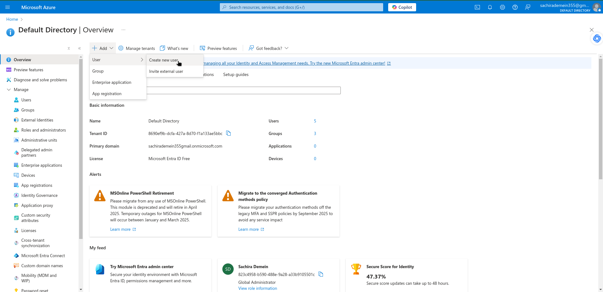

# Lab-01

<figure><figcaption>
Lab-01 Question
</figcaption></figure>

## Go to Azure Portal And Click to Microft Entra ID

<figure><figcaption></figcaption></figure>

## Create New User

<figure><figcaption></figcaption></figure>

<figure><figcaption></figcaption></figure>

<figure><figcaption></figcaption></figure>

## Invite an External User

<figure><figcaption></figcaption></figure>

<figure><figcaption></figcaption></figure>

## External User Receiving a Mail

<figure><figcaption></figcaption></figure>

<figure><figcaption></figcaption></figure>

## Creating a Group and Adding Members

<figure><figcaption></figcaption></figure>

<figure><figcaption></figcaption></figure>
